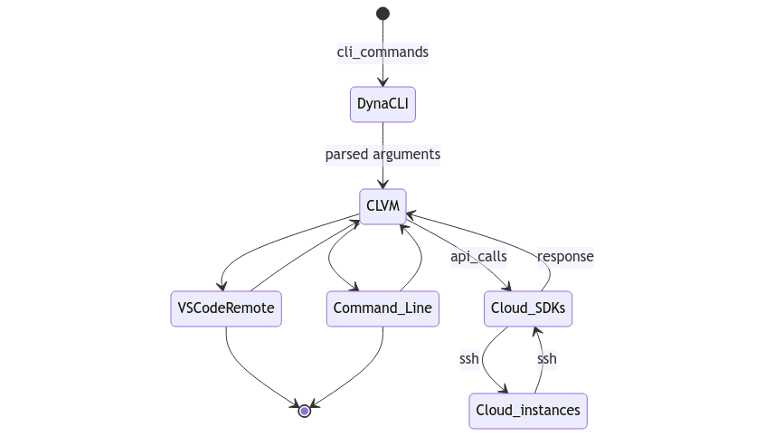

# Simplify Cloud Instance Management from Your Command Line


Cloud computing is tremendously empowering, but it comes with its own set of frustrations. Let's say you're a developer using cloud instances for projects and development purposes. One struggle is that you have to follow the steps below to ready your instance for use and connect to it most simplistically (using AWS as an example).

1. Log in to the web interface of AWS.
2. Go to the EC2 Management Console.
3. Generate a new ssh key and add it to AWS.
4. Select your instance and start it using buttons.
5. Find your instance's user name and public DNS name.
6. Open the terminal and type `ssh -i <ssh_key_path> <user_name>@<public_dns_name>`

If you plan to use VSCode Remote or port redirection to access your cloud instance resources, then these steps are doubled.

It turns out you have to use your mouse or touchpad to hover over and click lots of buttons to start/stop instances and configure and use these cloud services via a web interface. This is an unproductive way to work. Modern problems require modern solutions.
 
Please, meet [CLVM(Cloud VM)](https://github.com/BstLabs/py-clvm). It will make your life easier.
 
CLVM is an open-source command-line tool that provides convenient access to users' cloud instances over an SSM connection.
It's built on top of [DynaCLI](https://github.com/BstLabs/py-dynacli), another excellent open-source tool from [BST Labs](https://github.com/BstLabs/).

### <b>Overview Diagram of CLVM</b>

## <b>Capabilities of CLVM</b>
1. Instance start/stop and listing operations
2. SSH key generation and tunneling
3. Session management
4. Port redirection (forwarding)
5. VSCode Remote utilities
6. Support for AWS, GCP, and, Azure
 
## <b>Motivation</b>
The rationale behind this tool is to end the struggle of using the web interface to access and configure several services to handle cloud instances. Based on developer surveys, many folks use VSCode for their daily workflow; so do the engineers of BST Labs. To improve the development experience, we have replicated the varied solutions for handling different steps of using cloud virtual machines and combined them with VSCode Remote to deliver maximum convenience for fellow developers and engineers.
 
In this article, I will try my best to show how CLVM can help to decrease the inconveniences associated with a cloud environment. I will mostly write about using AWS, GCP, Azure Instances, SSM Sessions, and VSCode Remote through CLVM. In particular, connecting through VSCode Remote has never been this easy. So, without further ado, let's dive into the topic.
 
 
## <b>Installation</b>
Install it via `pip`
```console
$ pip3 install pyclvm
```
 
Thanks to DynaCLI, when installation is finished you will have the `clvm` command added to your terminal palette.
 
With a quick maneuver, just type `clvm -h` and you can read automatically derived docstrings and usage.
 
```console
$ clvm -h
usage: clvm [-h] [-v] {connect,instance,plt,redirect,ssh,ssm,vscode} ...
 
Command Line Utility to connect or redirect ports to a Cloud Virtual Machine
 
positional arguments:
 {connect,instance,redirect,ssh,ssm,vscode}
   connect             connect to a Virtual Machine
   instance            vm instance management
   plt                 change default platform (AWS, GCP, AZURE)
   redirect            start/stop port redirection session
   ssh                 start/stop ssh session
   ssm                 session manager utilities
   vscode              microsoft vscode utilities
 
optional arguments:
 -h, --help            show this help message and exit
 -v, --version         show program's version number and exit
```

## <b>Working with instances</b>

### <b>SSH key generation</b>
We need to secure the connection between two machines with a new ssh key generation. This responsibility is on CLVM as well. 
```console
$ clvm ssh new <instance_name> platform=<aws, gcp or azure>
``` 
This statement generates and saves the SSH key to the corresponding directory in both of the endpoints(the local machine and the remote instance). This feature uses [AuthK](https://github.com/BstLabs/py-authk) library under the hood.

#### <b>SSH tunneling</b>
`clvm ssh start` command can be used for SSH tunneling. You need to specify <instance_name> as always and <port_number>.

The fastest route is to type `clvm connect <instance_name>`. It automatically starts the VM instance and connects to it.

To only start an instance we need to type:
```console
$ clvm instance start <instance_name> platform=<aws, gcp or azure>
Starting <instance_name> ...
<instance_name> is running
```
Next, we connect to our running instance via `clvm connect <instance_name>` and et voilà! We can operate within our instance from the local terminal. Of course, you are not limited to using only the terminal. VSCode Remote and Port redirection are some of the choices. Please, suit yourself.

### <b>Default and optional configuration arguments</b>
Currently, CLVM supports AWS, GCP, and Azure. So optional arguments will be important to maintain these resources. Please consider that we have only 3 optional arguments with default values for now, `platform`, `profile` and `8080` as the port arguments. Default values are applied unless the optional arguments are explicitly specified.

They are as follows:

`platform` = AWS

`profile` = default

`8080` = 8080   #<i>port</i>

You can set it to your preferred platform, profile and/or port via passing it explicitly.

Example:

```console
$ clvm connect <instance_name> profile=<profile_name>
$ clvm redirect <instance_name> profile=<profile_name> <local_port>=<port_number>
$ clvm redirect <instance_name> profile=<profile_name> <local_port>=<port_number> platform=<aws, gcp or azure>
```

### <b>Setting default cloud platform</b>
Although the default platform is set to AWS you can change it to GCP or Azure. This way, you don't have to type the optional argument `platform` within the statements, and in case you forgot which is your default platform then it's covered too. The examples below will demonstrate these functionalities.

```console
$ clvm plt
Default platform is AWS
```

```console
$ clvm plt azure
Default platform is AZURE
```

### <b>Working with VSCode Remote over SSH</b>
You can get the most out of CLVM by using VSCode Remote.
To do that we have the `clvm vscode` command.

```console
$ clvm vscode -h
usage: clvm vscode [-h] {install,start} ...

positional arguments:
  {install,start}
    install        install vscode local
    start          obtain token, start instance if required, and launch vscode editor

optional arguments:
  -h, --help       show this help message and exit
``` 
As apparent in the documentation, in case you don't have VSCode installed on your local machine, you can use `install` to do all the installation steps automatically. You also will have some useful vscode extensions installed like Python, remote-ssh, LTeX, etc.

### <b>Port redirection</b>
In my example, I have VSCode installed on my cloud instance. So, if I use `clvm redirect start <instance_name>` I'll have my vscode server set on `http://localhost:8080/` ready.
Easy, isn't it?! That reduces the complex port redirecting process via bash scripting down to the use of only 4 consecutive statements. You don't even have to start instances separately, because the `redirect` command does that for us. Stopping redirection is a piece of cake too. Just type `stop` instead of `start` and it will exit from redirection and stop the instance as well.

### <b>Session management</b>
With the help of CLVM, we have good control over sessions.

```console
$ clvm ssm -h
usage: clvm ssm [-h] {shell,session,clear} ...

positional arguments:
  {shell,session,clear}
    shell               execute shell script over ssm channel
    session             session manager session utilities
    clear               clear stored session credentials

optional arguments:
  -h, --help            show this help message and exit
```


```console
$ clvm ssm session -h
usage: clvm ssm session [-h] {start,stop,ls} ...
 
positional arguments:
 {start,stop,ls}
   start          start ssm session
   stop           terminate ssm session
   ls             display active sessions

optional arguments:
 -h, --help       show this help message and exit
 
```
With CLVM, it's possible to send shell commands to cloud instances directly from your local terminal. For that purpose, it has a `clvm ssm shell` statement. It takes an instance name as the first argument and commands in string format. To pass several commands you need to separate them with commas. For example:
```console
$ clvm ssm shell <instance_name> "echo From cloud instance", "echo Hello, World!"
<instance_name> is running
From cloud instance,
Hello, World!
```

One of the good things about CLVM is that the syntax is very intuitive and easy. The help messages and commands are pretty self-explanatory.

## <b>Summary</b>
The article describes a high-productivity open-source solution for cloud developers and enthusiasts. It explains how CLVM helps to "do the necessary things" and not experience stress over gibberish code. The tool hides all the underlying nerdy processes and provides users with a clean and secure cloud development experience.
***
## Acknowledgment
There's several minds behind CLVM with whom I want to share my appreciation for making this project happen:

[Avital Yahel](https://www.linkedin.com/in/avitalyahel/) - Came up with the project idea

[Asher Sterkin](https://www.linkedin.com/in/asher-sterkin-10a1063/) - Developed the first version and technical guide

[Lior Kashti](https://www.linkedin.com/in/lior-kashti/) - Contributed to AWS instance mapping

[Dmitro Slobodchikov](https://www.linkedin.com/in/dmitry-slobodchikov-643611b0/) - Maintainer and technical guide

[Shahriyar Rzayev](https://www.linkedin.com/in/shahriyar-rzayev/) - Maintainer and technical guide

[Scott Lichtman](https://www.linkedin.com/in/scottlichtman/) - Content guide


*The author, [Orkhan Shirinov](https://www.linkedin.com/in/orkhan-shirinov-65475677/), is a software developer in BST LABS and one of the maintainers of CLVM. CLVM is an open-source project maintained by [BST LABS](https://github.com/BstLabs/). Our goal is to make organizations fully realize the extensive potential of cloud computing through a range of open source and commercial solutions. We are best known for [CAIOS](https://www.caios.io/home), a portable cloud operating system and development platform featuring Infrastructure-from-Code technology. BST LABS is a software engineering unit of [BlackSwan Technologies](https://www.blackswantechnologies.ai).*
